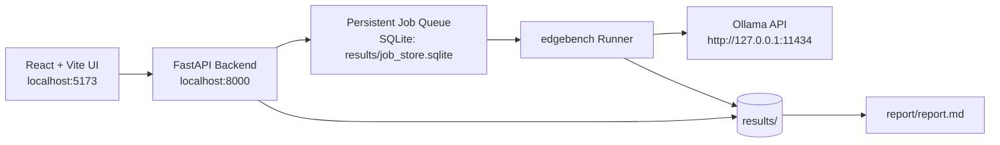

# EdgeBench: Local LLM Benchmark + Structured Output Guardrails

Offline-first benchmark system for local Ollama models on Windows. It measures latency/throughput, enforces strict JSON schema outputs with one-retry repair, tracks determinism, and generates reports from measured local artifacts.

## Architecture Diagram



## Core Features
- Fully local runtime (no internet required for benchmarking).
- No paid APIs, no telemetry, prompts/results remain local.
- Streaming Ollama requests with real TTFT capture.
- Strict JSON-only contract with Pydantic v2 validation and one repair retry.
- Determinism and temperature sweep analysis.
- Local UI for model/tag controls, job queue, live logs, metrics charts, and exports.

## Security Posture
- Backend scripts bind to `127.0.0.1` only.
- CORS is explicitly restricted to local frontend origins.
- Runtime network target is local Ollama only.
- Artifacts stay under local `results/`.

## Model Configuration
Benchmark logical model groups using configurable tags in `config/models.yaml`:
- `llama3.2-mini`
- `54Mini`
- `mistral-7b`

Tags are examples only. Always verify locally:

```powershell
ollama list
ollama pull <tag>
```

If a tag is missing, choose another available local tag.

## Windows Setup

```powershell
cd C:\Users\lalwa\Downloads\edgebench-local-guardrails
.\scripts\setup_windows.ps1
```

First run helper:

```powershell
.\scripts\first_run.ps1
```

Start services:

```powershell
.\scripts\run_backend.ps1
.\scripts\run_frontend.ps1
```

## CLI

Benchmark:

```powershell
python -m edgebench.cli benchmark --models config/models.yaml --dataset data/prompts_3250.jsonl
```

Benchmark with explicit scorer and timeouts:

```powershell
python -m edgebench.cli benchmark --models config/models.yaml --dataset data/prompts_3250.jsonl --scorer exact_json --request-timeout-seconds 120 --job-timeout-seconds 0
```

Temperature sweep:

```powershell
python -m edgebench.cli sweep --models config/models.yaml --dataset data/prompts_3250.jsonl --temps 0.0,0.2,0.5,0.8
```

Report:

```powershell
python -m edgebench.cli report --results results/latest --out report/report.md
```

Validate dataset:

```powershell
python -m edgebench.cli validate-dataset --dataset data/smoke_prompts_10.jsonl
```

Doctor (CLI readiness + Ollama reachability):

```powershell
python -m edgebench.cli doctor --dataset data/smoke_prompts_10.jsonl
```

Generate placeholder 3250 dataset:

```powershell
python -m edgebench.cli synth-dataset --out data/synthetic_prompts_3250.jsonl --count 3250
```

## CLI-Only Workflow (No UI Required)

Use the PowerShell wrapper:

```powershell
.\scripts\edgebench_cli.ps1 doctor --dataset data/smoke_prompts_10.jsonl
.\scripts\edgebench_cli.ps1 benchmark --models config/models.yaml --dataset data/smoke_prompts_10.jsonl --repeats 1
.\scripts\edgebench_cli.ps1 report --results results/latest --out report/report.md
```

You can pass any extra `edgebench.cli` arguments after the command.

## Result Artifacts
Per run:
- `results/<run_id>/results.jsonl`
- `results/<run_id>/summary.json`
- `results/<run_id>/metrics.csv`
- `results/<run_id>/config_snapshot.yaml`

The UI `Run Detail` page can load any existing `results/<run_id>` folder via backend result endpoints.

## macOS Later (not implemented)
- Port PowerShell scripts to shell scripts.
- Keep same FastAPI + edgebench core + frontend.
- Preserve localhost-only runtime behavior.

## Design docs
- `docs/design-decisions.md`
- `docs/ADR-0001-architecture.md`
