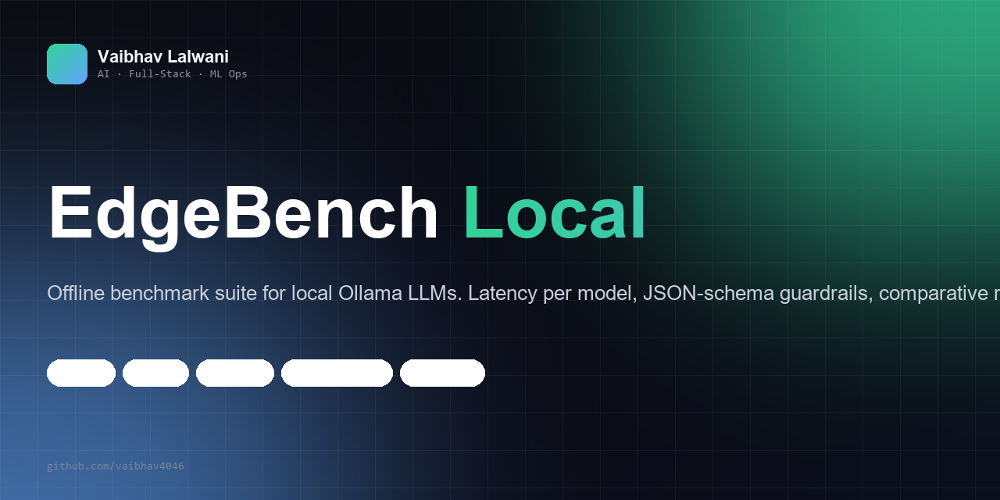

# edgebench-local-guardrails

<p align="center">
  <a href="#"></a>
</p>

> **Offline benchmark suite for local LLMs on Windows** — measures latency, throughput, and enforces structured JSON schema output validation across Ollama models.

[](https://python.org)
[](https://ollama.com)
[](LICENSE)
[](https://github.com/vaibhav4046/edgebench-local-guardrails)

---

## What This Does

Running local LLMs is easy. Knowing **which model performs best for your specific task** on your specific hardware is the hard part. edgebench-local-guardrails solves this by:

- **Benchmarking multiple Ollama models** side-by-side on identical prompts
- **Measuring latency (ms/token), throughput, and first-token delay** per model
- **Enforcing JSON schema guardrails** — validates that model outputs conform to a defined schema, rejecting and retrying malformed responses
- **Generating comparative reports** so you can make data-driven model selection decisions offline

---

## Key Features

- Run the same prompt across N Ollama models in one command
- Define output schemas (JSON Schema spec) — auto-validates and retries on failure
- Per-model latency stats: min / max / p50 / p95 / p99
- Export results to JSON or CSV for further analysis
- Runs fully offline on Windows — no API calls, no cloud dependency
- One-retry schema repair with determinism tracking

---

## Quick Start

```bash
# 1. Clone the repo
git clone https://github.com/vaibhav4046/edgebench-local-guardrails.git
cd edgebench-local-guardrails

# 2. Install dependencies
pip install -r requirements.txt

# 3. Make sure Ollama is running with models pulled
ollama pull llama3
ollama pull mistral

# 4. Run a benchmark
python benchmark.py --models llama3 mistral --prompt "Summarize the following..." --schema schema/summary.json
```

---

## Defining a Guardrail Schema

```json
{
  "type": "object",
  "properties": {
    "summary": { "type": "string" },
    "key_points": { "type": "array", "items": { "type": "string" } },
    "confidence": { "type": "number", "minimum": 0, "maximum": 1 }
  },
  "required": ["summary", "key_points"]
}
```

The system retries up to `MAX_RETRIES` times if a model returns output failing schema validation — marking failures in the final report.

---

## Sample Output

```
Model        | Avg Latency | p95 Latency | Schema Pass Rate
-------------|-------------|-------------|------------------
llama3       | 312ms/tok   | 480ms/tok   | 94%
mistral      | 278ms/tok   | 401ms/tok   | 89%
phi3         | 195ms/tok   | 290ms/tok   | 76%
```

---

## Architecture

```
edgebench-local-guardrails/
├── backend/              # Core benchmark runner
├── frontend/             # Results dashboard UI
├── config/               # Model and schema configurations
├── data/                 # Sample prompts and test data
├── docs/                 # Documentation and CLI screenshots
├── report/               # Auto-generated benchmark reports
├── scripts/              # Utility scripts
└── tests/                # Test suite
```

---

## Why This Matters

With the explosion of local LLMs (Llama 3, Mistral, Phi-3, Gemma), developers need objective tooling to decide which model to deploy for a given task — especially when JSON-structured outputs are required for downstream pipelines. This tool fills that gap for Windows/offline environments.

---

## License

MIT — use freely, attribution appreciated.

---

<div align="center">
  Made by <a href="https://github.com/vaibhav4046">Vaibhav Lalwani</a> · <a href="https://linkedin.com/in/vaibhav-lalwani">LinkedIn</a>
</div>
